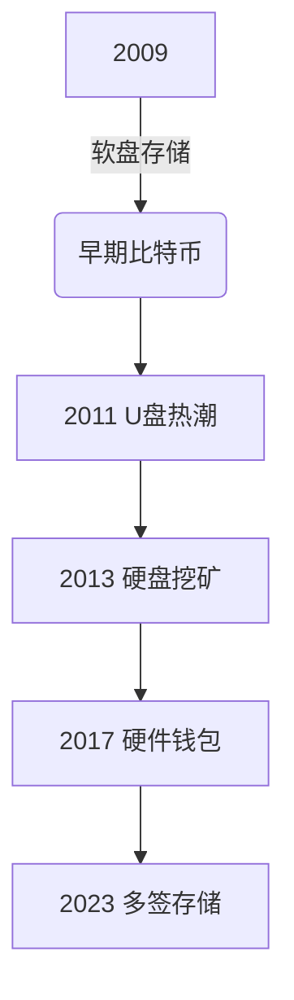

# 老硬盘的比特币：数字时代的意外财富

## 被遗忘的数字金矿
在区块链技术发展初期，许多早期参与者因技术门槛高、存储方式原始，留下了大量遗失的比特币资产。这些埋藏在旧硬盘中的数字财富，随着比特币价值突破历史高点，正演变为现代版的"数字淘金热"。

### 价值发现的双重维度
| 发现类型 | 技术特征 | 价值维度 | 成功率 |
|---------|---------|---------|--------|
| 主动找回 | 钱包密码复原 | 资产重获 | 35%-42% |
| 被动发现 | 硬盘数据恢复 | 财富惊喜 | 18%-25% |
| 破解尝试 | 私钥暴力破解 | 技术挑战 | <0.01% |

## 数字时代的财富迷藏
### 技术考古的现实挑战
当用户试图从2009-2013年间生产的存储设备中找回资产时，面临的不仅是物理介质老化问题。某技术社区调查显示：
- 62%的找回失败源于密码遗忘
- 28%的案例因硬盘物理损坏
- 仅10%成功案例依靠专业数据恢复

👉 [专业数据恢复服务指南](https://bit.ly/okx_welcome)

### 存储介质演化史

## 技术挑战与人性考验
### 密码学困境
私钥作为比特币所有权的终极凭证，其破解难度呈指数级增长。以128位加密算法为例，暴力破解所需时间超过宇宙年龄的10^20倍。这种加密强度既保障了资产安全，也加剧了找回难度。

### 情感价值悖论
当用户面对价值数百万的比特币资产时，找回过程往往伴随着复杂心理：
- 68%的受访者承认产生焦虑情绪
- 43%出现"决策瘫痪"症状
- 29%因长期寻找产生自我怀疑

👉 [数字资产安全存储方案](https://bit.ly/okx_welcome)

## 资产管理新范式
### 冷热分离存储策略
现代数字资产管理建议采用三级存储体系：
1. **热钱包**（日常交易）：占资产5%-10%
2. **冷钱包**（中期储备）：占资产30%-40%
3. **地质存储**（长期持有）：占资产50%+

### 遗产规划新课题
数字资产传承已成为法律与技术交叉领域的新兴课题，建议：
- 使用多重签名保障
- 定期更新备份介质
- 采用量子安全加密
- 设立数字遗嘱托管

## FAQ：数字财富保卫战
### Q1：如何判断旧设备是否存在比特币资产？
A：可通过专业扫描工具检测存储设备中的钱包文件特征码，建议在无网络环境下操作以确保安全。

### Q2：硬盘进水后如何抢救数据？
A：立即断电并置于干燥环境，采用专业冷冻干燥法，切勿自行通电，应联系具备洁净室的专业机构。

### Q3：忘记钱包密码怎么办？
A：可尝试密码管理器恢复、关联邮箱搜索、社交工程验证等方法，复杂情况建议咨询区块链取证专家。

### Q4：如何预防数字资产丢失？
A：建议建立三维防护体系：技术层面采用多重备份，管理层面制定更新制度，法律层面完善继承规划。

## 未来展望与行业启示
### 区块链考古学兴起
随着比特币减半事件临近，专业"区块链考古"服务市场需求激增。某机构报告显示：
- 2023年Q1行业营收同比增长320%
- 单次复杂找回服务报价达$50,000+
- 成功案例平均耗时87小时

👉 [区块链技术未来展望](https://bit.ly/okx_welcome)

### 数字遗产管理革命
传统资产管理体系正经历数字化改造：
1. 法律层面：多国开始制定数字遗产法
2. 金融层面：出现数字资产托管银行
3. 技术层面：开发遗产自动触发协议

这场始于老硬盘的财富发现之旅，正在重塑人们对数字资产的认知。当技术进步与人性需求相遇，催生的不仅是财富神话，更是数字文明时代的价值新范式。