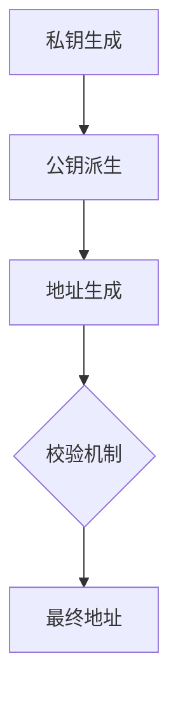

# ERC20钱包地址详解：定义、获取与使用指南

## 什么是ERC20钱包地址？

ERC20钱包地址是以太坊区块链上的数字资产身份标识符。作为符合ERC20技术标准的唯一账户凭证，它由42位十六进制字符组成，以"0x"为前缀（如：0x5aAeb6053F3E94C9b9A09f33669435E7Ef1BeAed）。这种标准化地址格式确保了以太坊生态内代币的互操作性，使用户能够安全地进行加密货币存储、转账和智能合约交互。

### 核心功能解析
- **资产接收**：通过公开地址实现点对点转账
- **交易验证**：配合私钥完成区块链交易签名
- **智能合约交互**：作为DApp应用的身份凭证
- **多链兼容**：支持以太坊及EVM兼容链的代币管理

> **安全提示**：地址误操作可能导致资产永久丢失，务必双重验证收款地址

---

## ERC20钱包类型全景图

| 钱包类型     | 安全等级 | 使用便捷性 | 推荐场景                  |
|--------------|----------|------------|---------------------------|
| 软件钱包     | ★★★☆     | ★★★★       | 日常交易/DeFi操作         |
| 硬件钱包     | ★★★★★    | ★★☆        | 长期存储/大额资产保护     |
| 移动钱包     | ★★★★     | ★★★★★      | 移动支付/快速转账         |
| 网页钱包     | ★★★☆     | ★★★★       | 临时操作/跨设备访问       |

### 主流钱包推荐
1. **MetaMask**：全球超3000万用户的首选钱包，支持浏览器扩展和移动端
2. **Trust Wallet**：Binance官方推荐，集成DApp浏览器和跨链功能
3. **Ledger Nano X**：硬件级安全防护，支持1800+加密资产
4. **Coinbase Wallet**：与美国合规交易所深度整合，新人友好型选择

👉 [立即获取您的加密资产门户](https://bit.ly/okx_welcome)

---

## 获取ERC20钱包地址的5步指南

### 第一步：选择安全可靠的平台
建议优先考虑通过[OKX钱包](https://bit.ly/okx_welcome)等合规平台创建账户，确保符合金融监管标准。

### 第二步：创建加密账户
1. 设置高强度密码（建议12位以上含特殊字符）
2. 保存助记词（建议使用金属备份工具）
3. 启用双重认证（2FA）

### 第三步：地址生成与验证
- 打开钱包应用进入"接收"界面
- 系统自动生成唯一地址（可生成多个地址）
- 使用二维码扫描功能验证地址准确性

### 第四步：地址备份策略
- 离线存储：写入纸质文档并存入保险柜
- 数字备份：使用加密U盘存储
- 多设备同步：确保至少三处独立备份

### 第五步：安全使用规范
- 首次转账建议小额测试
- 使用地址校验工具（如Blockchair）
- 定期更新钱包软件版本

> **常见误区**：合约地址≠钱包地址，误发合约地址将导致资产永久丢失

---

## 地址结构深度解析

### 技术组成
1. **网络标识**：0x（以太坊主网）或0X（测试网）
2. **公钥哈希**：通过ECDSA算法生成的160位数据
3. **校验机制**：采用Keccak-256算法的混合大小写校验

### 地址生成流程

---

## 使用场景与最佳实践

### 资产管理策略
- **冷热钱包分离**：日常交易使用移动钱包，长期存储采用硬件钱包
- **多链管理**：通过支持EVM的多链钱包统一管理跨链资产
- **智能合约交互**：连接Uniswap等DeFi平台进行流动性挖矿

### 安全防护措施
- 定期检查钱包授权（使用Revoke.cash工具）
- 启用地址白名单功能
- 使用硬件钱包进行大额交易

👉 [探索专业级资产安全管理方案](https://bit.ly/okx_welcome)

---

## 常见问题解答

**Q：如何验证钱包地址的有效性？**
A：可通过区块链浏览器（如Etherscan）进行地址校验，或使用钱包内置的校验功能。建议首次转账前发送0.001ETH测试。

**Q：钱包地址会随网络升级改变吗？**
A：不会，地址基于椭圆曲线加密生成，除非主动创建新钱包，否则地址永久有效。

**Q：如何处理误发其他链资产的情况？**
A：立即联系对应链的官方客服，部分跨链桥支持资产找回。例如OKX钱包提供专业的跨链资产恢复服务。

**Q：钱包丢失后如何恢复？**
A：使用助记词在相同钱包应用中导入即可恢复全部资产。切勿通过非官方渠道恢复资产。

**Q：能否修改现有钱包地址？**
A：地址不可修改，但可通过创建新钱包生成新地址。建议旧地址保持零余额状态。

---

## 专业级资产配置建议

对于持有价值超过$10,000的用户，建议采用：
- **3-2-1存储原则**：3份备份（硬件+云存+物理介质）
- **动态地址管理**：每季度更换主要收款地址
- **保险保障**：选择提供资产保险服务的钱包平台

> **行业趋势**：2025年Q1数据显示，采用多签钱包的机构投资者占比提升至47%

---

## 持续学习资源

1. **开发者文档**：以太坊官方ERC20技术规范（EIP-20）
2. **安全指南**：CertiK发布的《智能合约安全最佳实践》
3. **行业报告**：CoinDesk年度加密钱包市场分析

👉 [获取最新加密资产研究报告](https://bit.ly/okx_welcome)