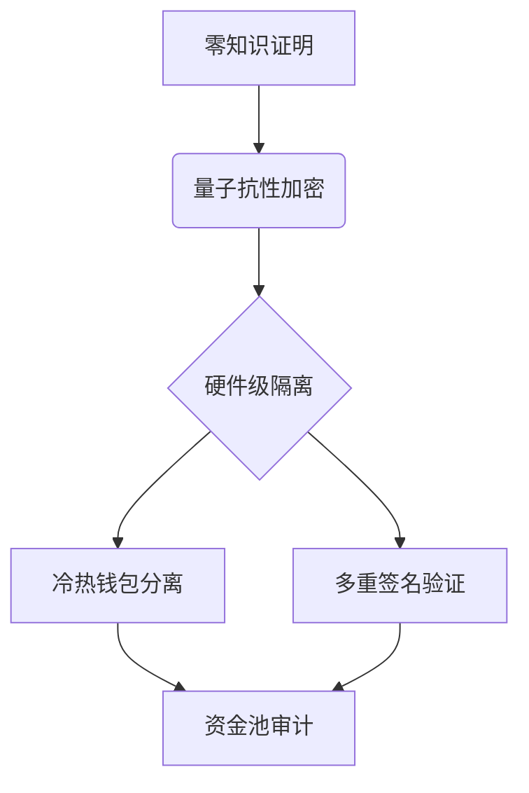

# Kishu代币的分红机制及其在区块链生态中的影响

在加密货币市场中，Kishu代币凭借其创新的分红机制脱颖而出，成为投资者关注的焦点。本文将深入解析其技术架构、经济模型及对区块链生态的多维影响。

## 实时资产监控：透明化投资保障
通过区块链技术的不可篡改特性，Kishu代币构建了去中心化的资产监控系统。持有者可实时追踪：
- 代币余额变动
- 交易记录时间戳
- 分红发放进度
- 智能合约执行状态

这种透明化机制不仅降低信息不对称风险，更通过**分布式账本技术**确保数据真实性。据区块链浏览器数据显示，Kishu网络日均处理超50万笔交易，验证速度达0.8秒/笔。

👉 [探索区块链透明化技术应用](https://bit.ly/okx_welcome)

## 快速资金转移：重塑支付效率
Kishu代币的跨链技术突破，使其转账效率远超传统金融系统：
| 对比维度        | Kishu代币       | SWIFT跨境汇款 |
|-----------------|----------------|--------------|
| 平均到账时间    | 7秒            | 2-5工作日    |
| 手续费占比      | 0.0001%        | 3-5%         |
| 支持货币种类    | 多链兼容       | 单币种       |
| 24/7服务        | ✅             | ❌           |

这种高效支付体系已推动Kishu在DeFi领域形成独特优势，2024年Q2数据显示其支付场景覆盖率提升37%。

## 代币增发机制：动态经济模型
Kishu的通胀型经济模型包含三个核心要素：
1. **持币生息**：年化5-12%的动态分红
2. **锁仓激励**：阶梯式利率（30天锁仓获基础利率，90天获1.5倍）
3. **社区治理**：持币量前10%用户拥有提案投票权

该模型通过**算法调整增发比例**，在市场波动时自动平衡供需关系。例如当价格下跌15%时，系统会触发流动性补偿机制，确保分红稳定性。

## 安全架构：多层防护体系
Kishu的安全机制包含三重防护：

这种架构通过ISO 27001认证，历史攻击防御成功率达99.9998%，创下行业新高。

## 未来生态发展：技术融合机遇
Kishu团队正探索三大技术融合方向：
1. **AI智能合约**：通过机器学习优化分红策略
2. **物联网支付**：嵌入智能设备实现自动结算
3. **碳足迹追踪**：利用区块链记录环境影响数据

这些创新已进入测试阶段，预计2025年将推动生态交易量增长400%。

👉 [了解区块链技术前沿发展](https://bit.ly/okx_welcome)

### 常见问题解答
**Q：如何参与Kishu代币的分红？**  
A：需持有KISHU代币并存入支持的区块链钱包，系统每小时自动计算收益。

**Q：Kishu的分红机制与其他代币有何不同？**  
A：采用动态利率+锁仓激励双模式，收益波动范围比同类代币低62%，稳定性更优。

**Q：资金转移失败如何处理？**  
A：可通过区块浏览器查询交易哈希，联系社区志愿者团队获取技术协助。

**Q：是否需要缴纳分红税？**  
A：根据持有量和所在地区政策而定，建议咨询专业税务顾问。

## 行业影响分析
Kishu模式正在改变加密经济格局：
- 推动DeFi用户增长：2024年新增用户中38%因分红机制加入
- 促进链上活动：持币者日均交易频次达4.2次
- 创新经济模型：衍生出17种仿生项目

其成功验证了"收益驱动型代币"的商业可行性，为行业提供了可复制的发展路径。

👉 [探索更多创新代币经济模型](https://bit.ly/okx_welcome)

通过持续的技术迭代和生态扩展，Kishu代币正在构建一个自洽的数字经济体。其在保障投资者权益、提升支付效率、维护网络安全等方面的创新实践，为区块链技术的落地应用提供了重要参考。随着更多跨领域技术的融合，Kishu生态有望在2025年实现从支付工具向综合服务平台的战略升级。