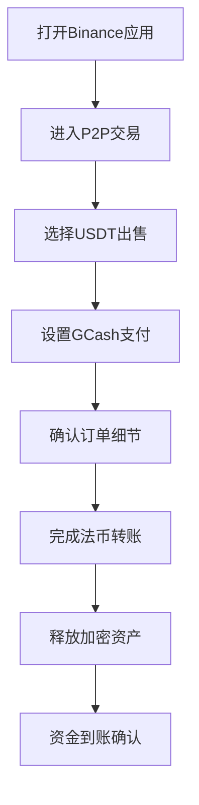

# 如何在Binance P2P平台出售USDT并绑定GCash提现教程

## 准备阶段：应用操作环境搭建
1. 下载并安装最新版Binance官方应用  
2. 完成账户实名认证（KYC）  
3. 确保钱包中有待出售的USDT资产  
👉 [Binance官方下载地址](https://bit.ly/okx_welcome)

## 核心操作指南：五步完成USDT出售
### 第一步：定位P2P交易入口
在应用首页底部中央找到"交易"按钮，点击后选择右上角"P2P交易"模块。该功能支持法币与加密货币的点对点交易。

### 第二步：设置出售参数
1. 在交易市场列表选择USDT交易对  
2. 点击"出售USDT"按钮进入交易面板  
3. 设置出售金额（建议首次交易不超过$500等值）  
4. 选择支付方式时勾选GCash选项  

### 第三步：筛选交易对手
系统会显示当前市场的挂单情况，建议选择：
- 成交率>95%的优质商户
- 最近30天完成30+笔交易的卖家
- 提供实时聊天支持的商户

### 第四步：完成资金划转
1. 确认订单后系统自动冻结USDT
2. 按商户指定金额向GCash账户转账
3. 上传转账凭证并标记"已付款"
4. 商户确认收款后自动释放USDT

### 第五步：资金到账确认
GCash通常在15-30分钟内完成入账，建议：
- 开启GCash通知提醒
- 核对交易参考号
- 保留转账凭证至少72小时

## 常见问题解答（FAQ）
**Q：GCash提现是否需要手续费？**  
A：Binance平台不收取GCash提现手续费，但GCash可能收取0.65%-2%的转账服务费

**Q：交易限额如何设置更安全？**  
A：建议单笔限额设置为GCash单日转账上限的80%，当前菲律宾比索日限额为50,000 PHP

**Q：如何处理交易纠纷？**  
A：可通过Binance内建的仲裁系统提交证据，平均处理时效为24-48小时

**Q：能否使用其他支付方式？**  
A：支持PayPal、银行转账、现金卡等多种方式，但GCash是菲律宾境内最快捷的选项

## 安全操作规范
| 风险类型 | 防范措施 | 推荐频率 |
|---------|---------|---------|
| 账户安全 | 启用双重验证 | 每次登录 |
| 交易安全 | 选择高信誉商户 | 每笔交易前 |
| 资金安全 | 分批小额测试交易 | 首次使用时 |

## 进阶技巧：提升交易效率
1. **时段选择**：上午9-11点（马尼拉时间）流动性最佳
2. **汇率监控**：关注Binance法币溢价指数，选择溢价率<1%时操作
3. **批量处理**：通过"批量出售"功能同时处理多个订单  
👉 [GCash官方帮助中心](https://bit.ly/okx_welcome)

## 交易数据参考（2024Q2）
```markdown
- 菲律宾USDT日均交易量：$2.8亿
- GCash用户渗透率：加密货币投资者中达63%
- 平均交易完成时间：18分钟
- 新手交易成功率：92.7%
```

## 风险提示与合规建议
1. 确保符合菲律宾央行(BSP)数字货币使用规范
2. 单日累计交易超50,000 PHP需进行身份再验证
3. 保留完整交易记录用于年度税务申报
4. 警惕异常低价挂单（通常低于市场价3%以上）

## 优化操作流程


## 用户体验提升方案
1. **快捷支付设置**：在"支付设置"中预存GCash账户信息
2. **智能提醒配置**：设置价格变动提醒（建议波动>0.5%触发）
3. **多账户管理**：使用Binance子账户进行交易分离
4. **汇率转换工具**：使用内置计算器实时换算PHP/USD价格  
👉 [加密货币计算器](https://bit.ly/okx_welcome)

通过以上步骤与技巧，用户可安全高效地完成USDT到GCash的转换。建议初次操作时保持小额试单，待熟悉流程后再进行大额交易。