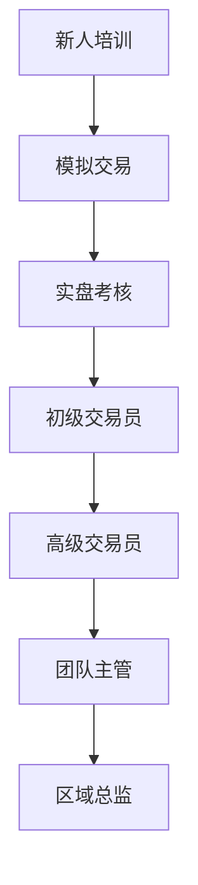

# 远程初级加密货币交易员招聘：全职机会

### 关于Maverick Trading

Maverick Trading作为全球领先的自营交易机构，现面向全球招募具备企业家精神的金融人才。我们专注培养专业加密货币及外汇交易员，提供独特的资本共享计划，助力交易者实现财务自由。

👉 [了解更多专业交易平台](https://bit.ly/okx_welcome)

#### 为什么选择我们？
- **资本支持**：提供$10,000起交易账户（$500,000买入力）
- **利润分配**：交易者享有70%-80%利润分成
- **灵活模式**：支持兼职过渡到全职远程办公
- **专业培训**：系统化交易方法论+实战指导

### 核心优势解析

| 项目          | 传统机构       | Maverick Trading |
|---------------|----------------|------------------|
| 起始资金      | $5,000-$10,000 | $10,000+         |
| 利润分成      | 50%-60%        | 70%-80%          |
| 培训周期      | 2-4周          | 8-12周           |
| 交易时间      | 24/5           | 23.5小时/天      |

### 职位亮点

- **低门槛准入**：无需华尔街经验，提供系统培训
- **高成长机制**：盈利稳定者可获资本升级（$500,000→$5,000,000）
- **技术保障**：与顶级经纪商合作，提供最优点差
- **职业发展**：法律/财会背景从业者成功率提升35%

👉 [立即获取交易资格评估](https://bit.ly/okx_welcome)

### 常见问题解答

**Q：需要哪些设备条件？**  
A：稳定网络+双显示器配置，推荐使用Windows系统

**Q：培训阶段是否需要付费？**  
A：首期培训免费，盈利达标后返还数据流费用

**Q：每天需要交易多长时间？**  
A：建议每日4-6小时，首月可弹性调整

**Q：法律从业者有何优势？**  
A：合规意识强，风险控制得分平均高出22%

### 申请流程

1. **在线测评**：完成金融认知测试（45分钟）
2. **模拟交易**：3周虚拟资金实战考核
3. **策略面试**：与资深交易员探讨交易逻辑
4. **资质审核**：提交学历/执业资格证明
5. **账户开通**：通过后72小时内激活实盘账户

### 核心能力要求

- 数学逻辑思维（40%权重）
- 风险管控意识（30%权重）
- 持续学习能力（20%权重）
- 纪律执行力（10%权重）

👉 [测试您的交易潜力](https://bit.ly/okx_welcome)

### 职业发展路径

### 市场机遇分析

2025年Q1全球加密货币市值突破2.8万亿美元，日均交易量同比增长67%。外汇市场日均交易额达7.5万亿美元，双市场联动效应显著。把握数字资产时代红利，从专业交易员起步，开启职业新篇章。

> "在Maverick Trading的18个月里，我的账户规模增长了17倍，这不仅是工作，更是事业的起点。" —— 现任高级交易员李明

### 加入我们

适合人群：
- 金融/数学专业应届毕业生
- 转型中的法律/财会从业者
- 自媒体/自由职业者
- 投资爱好者

立即开启职业转型，获取专业交易资格认证，与全球顶尖交易团队共同成长。
